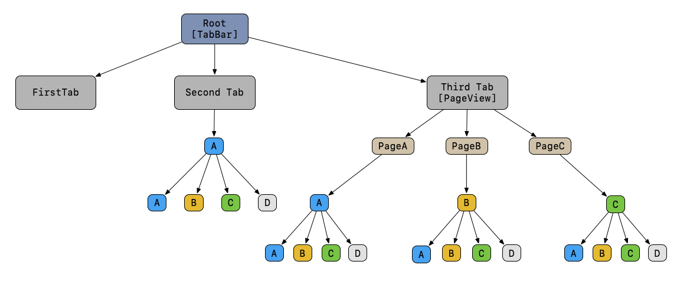

<p align="center">
    
</p>

<p align="center">
    <a href="https://github.com/JamitLabs/Portus/releases">
        
    </a>
    
    
    <a href="https://github.com/JamitLabs/Portus/blob/stable/LICENSE.md">
        
    </a>
</p>

<p align="center">
    <a href="#installation">Installation</a>
    <a href="#motivation">Motivation</a>
    <a href="#structure">Structure</a>
    <a href="#usage">Usage</a>
    <a href="https://github.com/JamitLabs/Portus/issues">Issues</a>
    <a href="#license">License</a>
</p>

# Portus

Portus is an UIKit- and architecture independent routing framework that easily integrates with your iOS apps. Usage enables enhanced features like in-app navigation or deeplinks.

## Motivation

Managing screenflow within iOS apps is complex, especially when dealing with advanced requirements like in-app navigation or deeplinks. Even though trivial solutions establish connections among screens, dealing with hard-coded links suffers from insufficient context information and scalabilty issues. *Portus* mitigate these issues and offers a defined framework for handling screenflow in a standardized way.

Screens within iOS apps are arranged on a stack or presented in succession to provide different level of information. Combined with user interface components, like *sliding menus*, *navigation-* or *tab bars*, paths are established that form the app's navigation tree. Each node in the tree either corresponds to a screen within the application or a branch node that is respondible for managing individual nodes.

## Goals and Requirements

Development of this framework was driven by the following requirements:

### UIKit-Independent:

First, the framework is designed to be independent of UIKit. This ensures that Portus does neither need to know about your app's view hierarchy nor about the relationship among view controllers. Rather the framework relies on a tree-based structure that consists of routing nodes, where each node states its routing capabilities by conforming to the `Enterable`, `Leavable` or `Switchable` protocol. Note that being independent of UIKit is crucial to meet the second requirement to be architectural independent.

### Architectute-Independent:

Second, Portus does not enforce an architectural pattern. Due to limitations of the *MVC* architecture, the community has come up with several alternatives, like *FlowControllers*, *Coordinators*, *MVVM*, *MVVM+RxSwift*. To seamlessly integrate with these architectures, we designed Portus to be architectural independent.

### Context-Driven:

Finally, nodes are entered in different contexts. For instance, the background color of a screen can differ depending on the value that is provided to the node. Hence, even though the requested node might already be open it might be necessary to reenter the node when the color value differs. With the combination of  `RoutingIdentifier` and `RoutingContext` nodes are uniquely identified.

## Structure

Portus uses three protocols, namely  `Enterable`, `Leavable` and  `Switchable` that inherit from the `Routable` protocol.
Nodes can conform to these protocols and state their routing capabilities as well as whether they manage additional nodes.

### Protocols

#### `Routable`

Conforming to the `Routable` protocol is required to specify a node's structure. The protocol requires a `RoutingEntry` that consists of the `RoutingIdentifier` as well as the `RoutingContext` and whether additional nodes are managed by the node. The latter requires to also specify an `activeEntry` that represents the managed node that is currently active. Below you find the definition of the `Routable` protocol:

```swift
protocol Routable: AnyObject {
    var entry: RoutingEntry { get }
}
```

#### `Enterable`

In addition to `Routable`, nodes can state whether they can enter additional nodes using the `Enterable` protocol:

```swift
protocol Enterable: Routable {
    func enterNode(
        with entry: RoutingEntry, 
        animated: Bool, 
        completion: @escaping ((Bool) -> Void)
    )
}
```

Enterables will receive the entry identifying the node to enter as well as wheter the entrance should be animated or not. Finally the node can indicate whether the entrance succeeded or failed by calling the completion. Note that calling the completion is mandatory.

#### `Leavable`

 `Leavable` represents an additional routing capability. Routables conforming to this protocol can leave a node for a given entry. Similar to `Enterable` calling the completion is mandatory and notifies the routing framework whether the operation succeeded.
 In addition, leavables can be asked whether they can leave a node for a given entry:

```swift
protocol Leavable: Routable {
    func leaveNode(
        with entry: RoutingEntry, 
        animated: Bool, 
        completion: @escaping (Bool) -> Void
    )
    func canLeaveNode(with entry: RoutingEntry) -> Bool
}
```

#### `Switchable`

Finally, nodes conforming to the `Switchable` protocol can determine one of their manage nodes to become active. Hence, nodes conforming to `Switchable` have to manage additional nodes.

```swift
protocol Switchable: Routable {
    func switchToNode(
        with entry: RoutingEntry, 
        animated: Bool, 
        completion: @escaping ((Bool) -> Void)
    )
}
```

Using above-stated protocols, nodes can be entered, left or become (in)active in a standardised way. Still, routing requires knowledge about the current state and hence requires a tree-based structure to keep track of the current screenflow. 

### `RoutingTree`

The `RoutingTree` is used by the `RoutingAlgorithm` to compute `RoutingInstructions` to either static or dynamic destinations. Note that the tree consists of individual nodes, where each `RoutingNode` may contain children. Still only one of a node's children can be active at the same time. This characteristic is crucial to compute an `activePath` that corresponds to the origin any routing request will start from.

The following operations can be performed on the `RoutingTree` and allow applications to provide information about when they enter, leave or switch to one of their managed nodes. This information is required by the `RoutingAlgorithm` to compute appropriate instructions to predefined destinations.

```swift
public func didEnterNode(withEntry entry: RoutingEntry)
public func didLeaveNode(with entry: RoutingEntry)
public func switchNode(
    withEntry entry: RoutingEntry, 
    didSwitchToNodeWithEntry targetEntry: RoutingEntry
)
```

### `Router`

The `Router` represents the main component of Portus and is used by applications to either request a route to a `StaticRoutingDestination`, i.e., a destination that is predefined in the `RoutingTable`, or to enter a `DynamicRoutingDestination`, i.e., a destination that does not depend on the current context and can be entered from everywhere. While *dynamic destinations* only consist of a single node, *static destinations* are represented by a list of nodes, where each list starts with the application's *root node*. Below you can find the signature of the operations as offered by the `Router`:

```swift
public func routeTo(
    staticDestination: StaticRoutingDestination,
    animated: Bool = true,
    executedInstructions: RoutingInstructions = [],
    completion: ((Result<RoutingInstructions, RoutingError>) -> Void)? = nil
) {
    ...
}
```

```swift
public func enter(
    dynamicDestination entry: RoutingEntry, 
    animated: Bool = true, 
    completion: ((Bool) -> Void)? = nil
) {
    ...
}
```
To request a route, static- and dynamic destinations need to be predefined in the `RoutingTable`. The `RoutingTable` includes knowledge about all reachable destinations using the routing framework. For instance, when requiring a deeplink to a screen within your app, you add a static route, describing the screen's location relative to your app's routing tree. However, having to state static destinations in the `RoutingTable` at compile time does not mean that they can not adapt to context information known at runtime. Below examples includes both a static route to a `colorList` not requiring any parameters, as well as a route to the color details screen depending on a hexadecimal value representing the color that is shown in the details screen. This way, you can adapt static routes at runtime as soon as the required context information is known.

```swift
extension RoutingTable.StaticEntries {
    static let colorList = [.root, .colorList].entries
    static func colorDetail(withHexString hexString: String) -> [RoutingEntry] {
        return [
            RoutingEntry(identifier: .root),
            RoutingEntry(identifier: .colorList),
            RoutingEntry(identifier: .colorDetail, context: ["hex": "\(hexString)"])
        ]
    }

    ...
}
```

In comparison, dynamic routes represent a single destination that is reachable from everywhere within your app: 


```swift
extension RoutingTable.DynamicEntries {
    static let a = RoutingEntry(identifier: .a)

    ...
}
```

## Demo Applications

We have included two demo applications, namely `Portus-iOS-Demo` and `Portus-iOS-Demo2` to demonstrate the framework's ability to deal with different architectures. The first demo application uses an architectural pattern called [Imperio](https://github.com/Flinesoft/Imperio), while the second sticks to the classic MVC approach. You can find visualizations of the example app's routing trees below:


Illustration, visualizing the routing tree of the first demo application, namely `Portus-iOS-Demo`:


Illustration, visualizing the routing tree of the second demo application, namely `Portus-iOS-Demo2`:



To include a non-trival structure, we included a `PageViewController` in the third tab of the second example app. The difficulty consists of keeping track of open paths when switching the active child of a switchable node. You can click through the sample app and open multiple screens each modifying the routing tree. Then, routes to static- as well as dynamic destinations are requested using the `RoutingMenu` as accessed using the device's shake-gesture.


## Routing Algorithm (TL;DR)

If you are interested in the underlying algorithm that is used by Portus to compute `RountingInstructions`, keep on reading. Otherwise, you may consider to skip this section.

The key component of the RoutingAlgorithm is `computeNextRoutingInstructions(...)`. Using this method the `Router` computes the next chunk of routing instructions in an iterative process and executes them until the desired destination is reached. The signature of `computeNextRoutingInstructions(...)` is given as follows:

```swift
internal static func computeNextRoutingInstructions(
    to destination: StaticRoutingDestination,
    completion: @escaping (Result<RoutingInstructions, RoutingError>) -> Void
) {
    ...
}
```

Note that `RoutingInstructions` is a typealias for `[RoutingInstruction]`, where a single instruction corresponds to one of the following cases:
    - `enter(entry: RoutingEntry)`: represents a node to be entered
    - `leave(entry: RoutingEntry)`: represents a node to be left
    - `switchTo(entry: RoutingEntry`, switchNodeEntry: RoutingEntry): represents a node to switch to

Computing the next chunk of routing instructions involves completing the following steps:
1. First, we need to check whether we are already at the destination. If this is the case, we are done and can return an empty list of instructions:
    ```swift
    guard origin != destination else {
        completion(.success([]))
        return
    }
    ```

2. Otherwise, i.e., when the destination is not yet reached, we determine the first mismatch index, i.e., the first index from which on the origin and destination path differ. Using this index, we can handle `Leavables`, `Switchables` and `Enterables` respectively.

    ```swift
     let firstMismatchIndex: Int? = {
        for index in 0 ... maxIndex {
            guard
                let originEntry = origin[try: index],
                let destinationEntry = destination[try: index],
                originEntry == destinationEntry
            else {
                return index
            }
        }

        return nil
    }()
    ```

3. We need to ensure that all leavable nodes along the path starting from the node corresponding to the first mismatch index up to the active leaf that are not managed by their parent (as indicated by `isManagedByParent`) can be left. This way we can gurantee that the desired destination is reached from the current context. For each of these nodes we introduce a new routingInstruction using `.leave(entry: ...)`:

    ```swift
    var leavingRoutingInstructions: RoutingInstructions = []
    let canLeaveCurrentContext: Bool = {
        for node in activePath.suffix(from: index).reversed() {
            guard let leavable = node.entry.routable as? Leavable, !node.isManagedByParent else { continue }

            guard leavable.canLeaveNode(with: node.entry) else { return false }

            leavingRoutingInstructions += [.leave(entry: node.entry)]
        }

        return true
    }()

    guard canLeaveCurrentContext else { return [] }
    guard leavingRoutingInstructions.isEmpty else { return leavingRoutingInstructions }
    ```

4. Next, when all nodes could be left that do not match the destination path, we need to check whether the predecessor of the active leaf is `Switchable` and contains the target node as one of its children. In this case, we can set the active child to the target node, by introducing a new routing instruction of the form `switchTo(...)`:

    ```swift
    if
        let switchNode = (RoutingTree.default.root?.activePath() ?? [])[try: index - 1],
        switchNode.children.count > 1
    {
        guard switchNode.children.map({ $0.entry.identifier }).contains(destination[index].identifier) else { return [] }

        return [.switchTo(entry: destination[index], switchNodeEntry: switchNode.entry)]
    }
    ```

5. Otherwise, if there is no `Switchable` we simply enter the part of the destination path by introducing `.enter(entry: ...)`:

    ```swift
    if let enterEntry = destination[try: index] {
        return [.enter(entry: enterEntry)]
    }
    ```

6. Finally, if the algorithm returns the next chunk of instructions as computed above, or indicates that the destination is not reachable using the following Error: `destinationNotReachable`

To illustrate this procedure, consider the following example:


1. Example:
    - Origin: `.switchNode1`, `.node2`, `.switchNode3`, `.node12`
    - Destination: `.switchNode1`, `.node1`, `.node5`, `.node8`
    - Computed Instructions: 
        `.leave(.switchNode3)`
        `.switchTo(.node1, switchNode: .switchNode1)`
        `.enter(.node5)`
        `.enter(.node8)`

2. Example:
    - Origin: `.switchNode1`, `.node1`, `.node5`, `.node8`
    - Destination: `.switchNode1`, `.switchNode2`, `.node4`
    - Computed Instructions: 
        `.leave(.node8)`
        `.leave(.node5)`
        `.switchTo(.switchNode2, switchNode: .switchNode1)`
        `.switchTo(.node4, switchNode: .switchNode2)`

3. Example:
    - Origin: `.switchNode1`, `.switchNode2`, `.node4`
    - Destination: `.switchNode1`, `.node1`, `.node6`, `.node11`
    - Computed Instructions: 
        `.switchTo(.node1, switchNode: .switchNode1)`
        `.enter(.node6)`
        `.enter(.node11)`

4. Example:
    - Origin: `.switchNode1`, `.node1`, `.node6`, `.node11`
    - Destination: `.switchNode1`, `.node2`, `.switchNode3`, `.node13`
    - Computed Instructions:
        `.leave(.node11)`
        `.leave(.node6)`
        `.switchTo(.node2, switchNode: .switchNode1)`
        `.enter(.switchNode3)`

Note that we have included Unit Tests based on the presented example to ensure that `RoutingInstructions` are properly computed by the `RoutingAlgorithm`. You can find them in `Portus/Tests/PortusTests`.

## Additional features/enhancements

The following issues/improvements can be addressed in future revisions:

- [ ] Enhance the demo applications by including some fancy UI
- [ ] Enhance the framework by proving a visualization of the current routing tree that can be used for debugging purposes.
- [ ] Introduce different routing algorithms, other then the minimum route to destination.
- [ ] Route to a given destination within a single animation, i.e. without animating each step in between
- [ ] Simulate routing instructions before executing them. This way, developers using the framework can be informed that a destination is not reachable before execution.

## Installation

Installation via [Carthage](https://github.com/Carthage/Carthage#carthage) & [SwiftPM](https://swift.org/package-manager/) are both supported.


## License
This library is released under the [MIT License](http://opensource.org/licenses/MIT). See LICENSE for details.